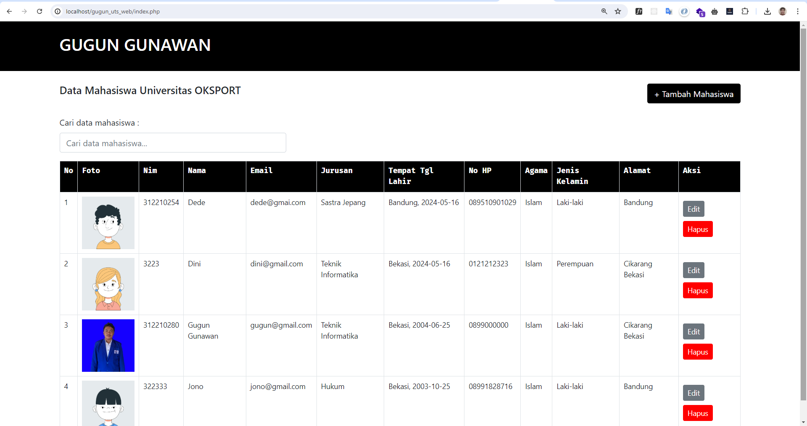
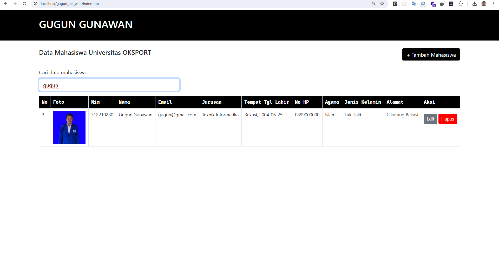
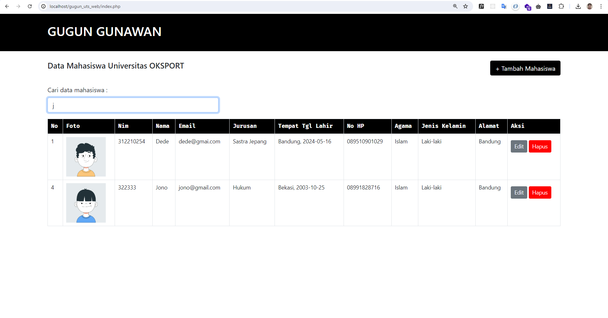
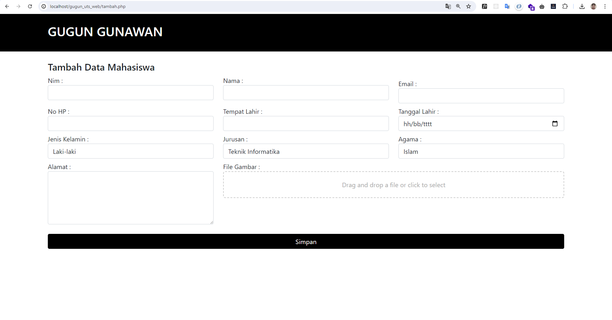
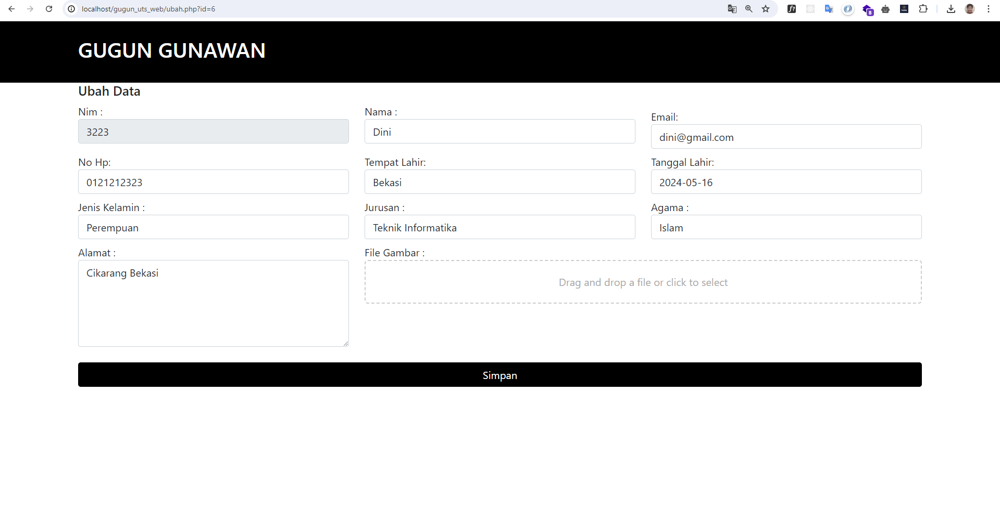

### TUGAS UTS PEMROGRAMMAN WEB 2

- Nama  : Gugun Gunawan
- NIM   : 312210280
- Kelas : TI.22.B1

Teknik Informatika
Universitas Pelita Bangsa

#### Berikut Outputt dari Sistem CRUD data Mahasiswa

Fitur didalamnya terdapat :

- Tambah data
- Ubah data
- Hapus data
- Tampilkan data
- Pencarian data

Berikut Screenshot sistem :

Halaman Utama :

Halaman Pencarian dengan realtime input ketika menginput kan huruf tabel otomatis
menampilkan sesuai yang diketikan dibuat menggunakan javasript DOM

dan :

Berikut Halaman Tambah data :

Berikut Halaman Ubah data :

